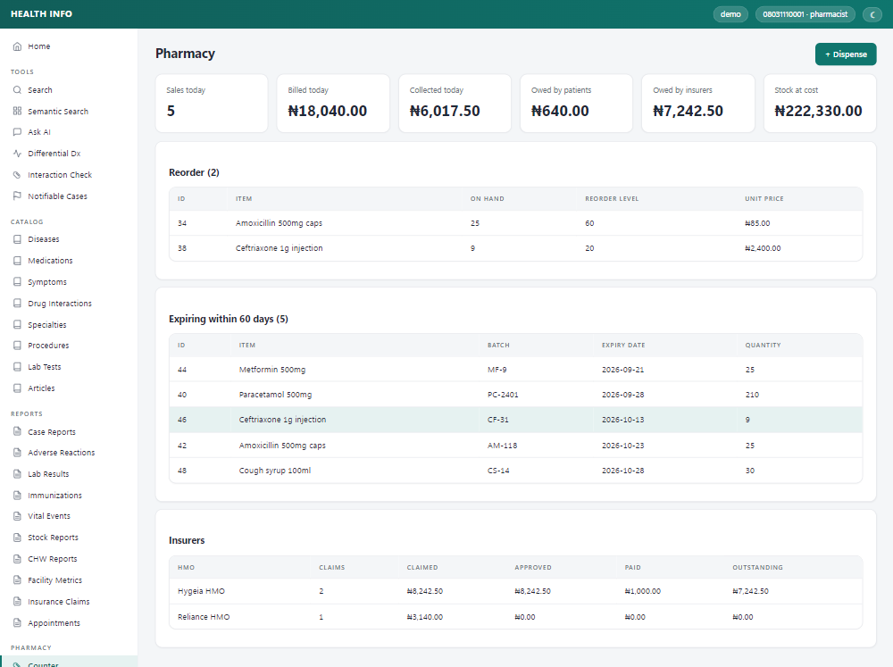
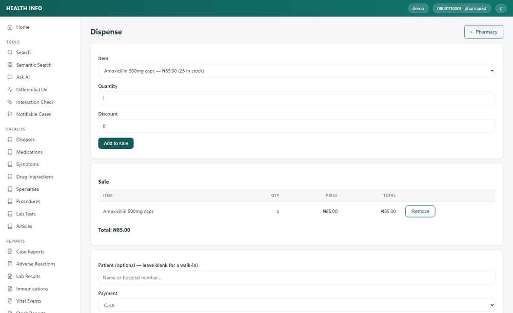
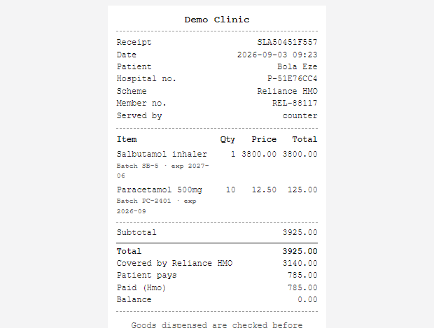
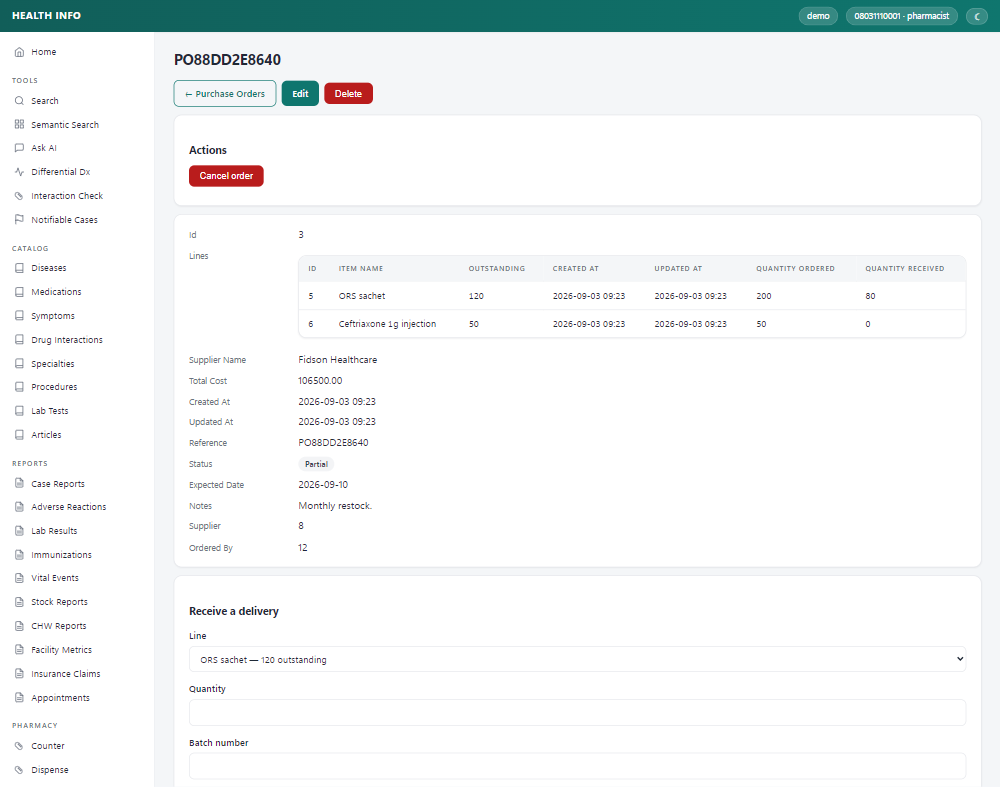
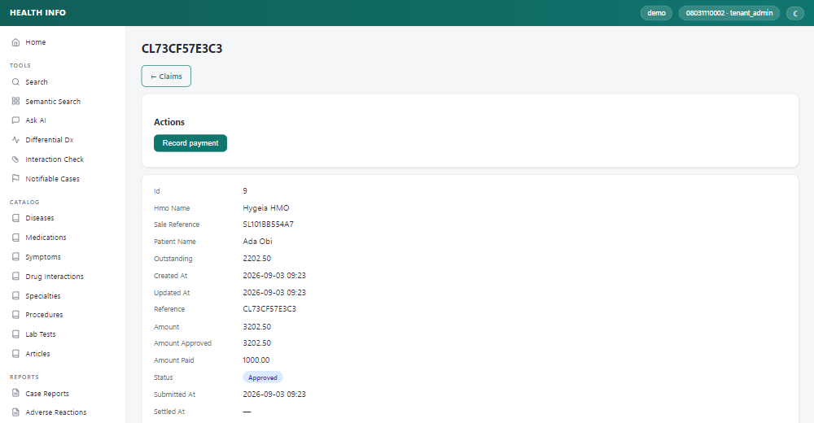
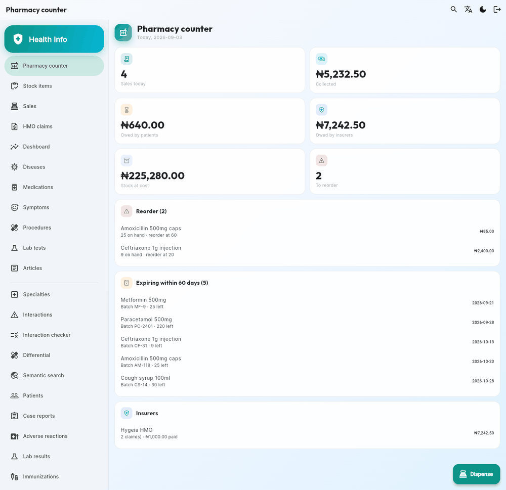
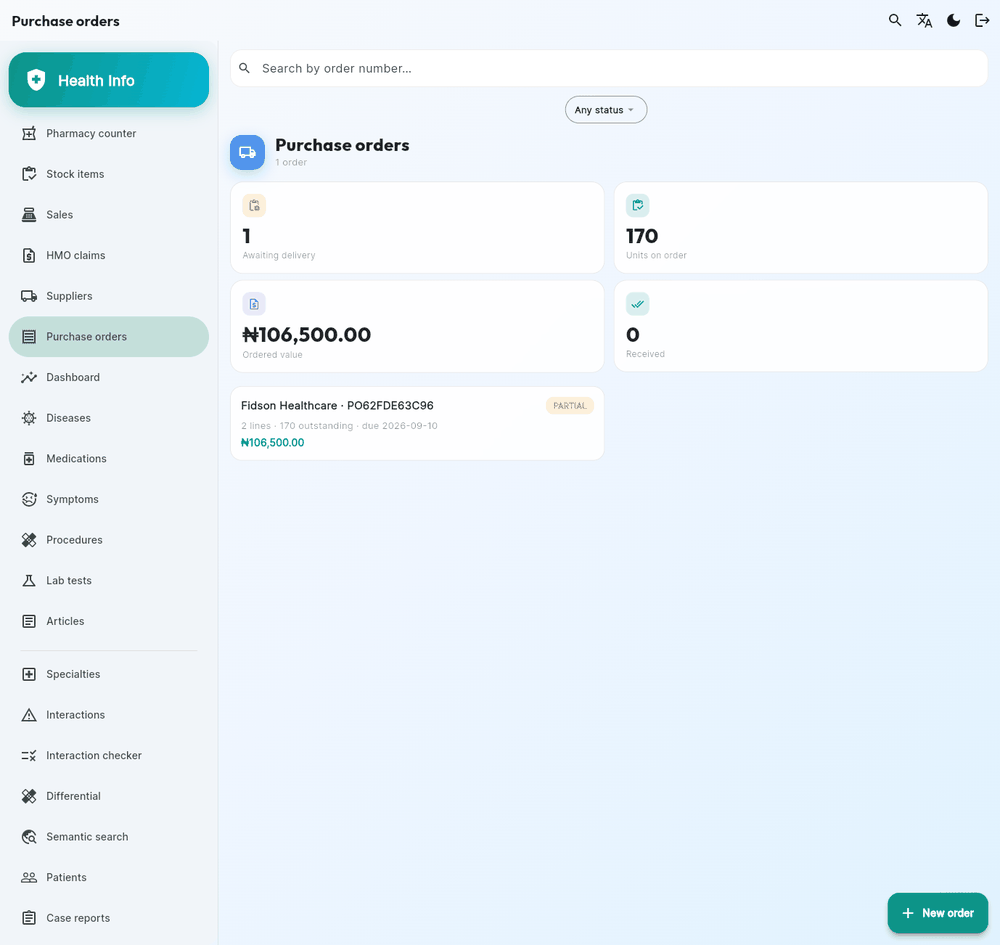
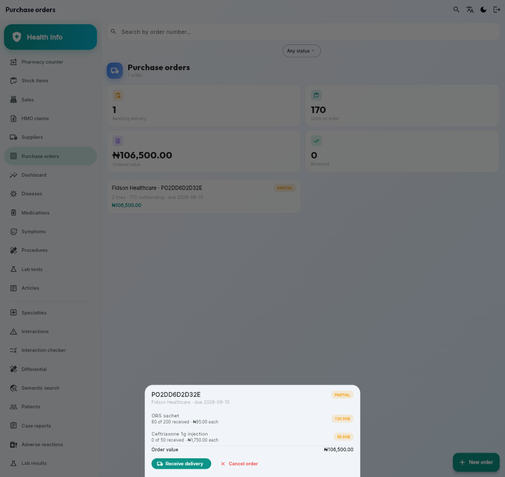
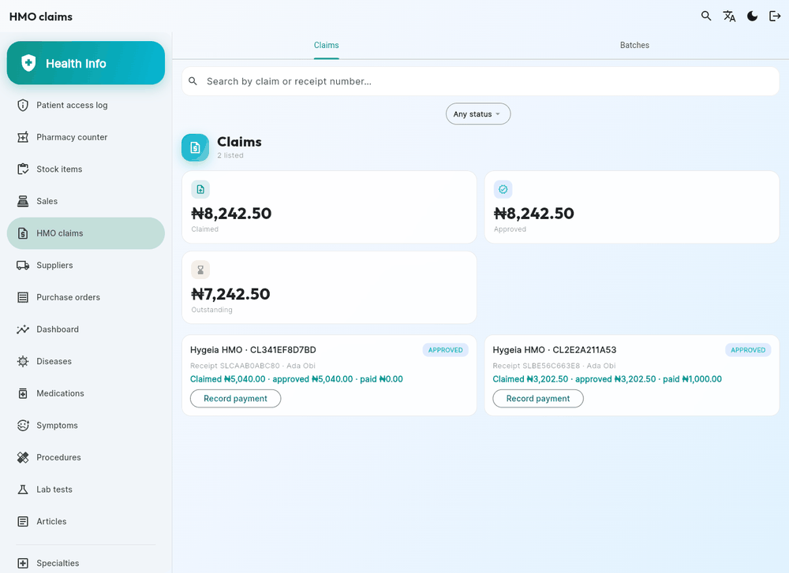

# Health Knowledge Platform — Backend (thin slice)

Runnable spine of the multi-tenant health platform. Proves the hard part —
**tenant isolation** — end to end, plus RBAC, eight content modules (diseases,
medications, symptoms, drug interactions, specialties, procedures, lab tests,
articles), DB-agnostic substring search, draft/review workflow + audit log,
knowledge-graph traversal, semantic search + RAG, Celery, analytics, Swagger.
Everything else from the full spec (Flutter, i18n, remaining content modules)
layers on top of this without changing it.

## Stack
Django 5 · DRF · JWT (simplejwt) · drf-spectacular · Celery · Docker
Default DB is **sqlite** (zero-config dev). Set `DB_HOST` for PostgreSQL or
MySQL (`DB_ENGINE`). Embeddings live in a JSON column and ranking is cosine in
Python — fully DB-agnostic, no pgvector or vector column on any backend.

## Run with Docker
```bash
cp .env.example .env
docker compose up --build
# create a super admin:
docker compose exec web python manage.py createsuperuser
```

## Run locally
```bash
pip install -r requirements.txt
cp .env.example .env          # set DB_HOST=localhost
python manage.py makemigrations tenants accounts catalog governance analytics
python manage.py migrate        # embeddings stored as JSON — portable, no pgvector extension needed
python manage.py runserver
```

## API
- `POST /api/auth/token/` — JWT login with `{phone, password}` → `{access, refresh}`
- `POST /api/auth/register/` — self-register into a tenant with `{phone, password}`
- `GET  /api/users/me/`
- `GET/POST /api/diseases/`, `/api/medications/`, `/api/symptoms/`,
  `/api/interactions/`, `/api/specialties/`, `/api/procedures/`,
  `/api/lab-tests/`, `/api/articles/`
- `GET  /api/search/?q=headache` — substring (`icontains`) search across all
  content modules, tenant-scoped, returns disclaimer
- `GET  /api/graph/diseases/{id}/`, `/api/graph/medications/{id}/` — graph traversal
- `POST /api/diseases/{id}/transition/` `{to,note}` · `GET .../history/` — workflow
- `GET  /api/ai/semantic-search/?q=...` — embedding cosine nearest-neighbour
  (computed in Python over the tenant's rows)
- `GET  /api/ai/ask/?q=headache and fever` — RAG (answer + sources + disclaimer)
- `GET  /api/health/` (alias `/healthz`) — DB-backed liveness probe (200/503), no auth
- `GET  /api/docs/` — Swagger UI

## AI / RAG
Embeddings stored as JSON, cosine ranking computed in Python (O(n) per-tenant
scan, no vector index). Runs with **no API key** by default (`AI_EMBED_PROVIDER=fake`,
deterministic non-semantic vectors) so dev/tests work offline. For real use:
```
AI_EMBED_PROVIDER=openai   OPENAI_API_KEY=sk-...     # real embeddings
ANTHROPIC_API_KEY=sk-ant-...                          # RAG answer synthesis
```
Without `ANTHROPIC_API_KEY`, `/api/ai/ask/` returns retrieval-only (sources, no
generated answer — no fabrication). Build the index:
```bash
python manage.py reindex      # embeds published content for every tenant
```

## Celery (async embedding + analytics)
`docker compose up` starts `worker` (tasks) and `beat` (nightly reindex at 03:00).
- **Embedding** is enqueued automatically on content save/delete via a
  post-commit signal — publish a disease and its vector appears without a
  manual `reindex`. Unpublish/delete removes it.
- **Analytics** events (`search`, `view`) are recorded fire-and-forget; a broker
  outage never breaks the request.

Run a worker locally: `celery -A config worker -l info` (needs Redis).
Set `CELERY_TASK_ALWAYS_EAGER=1` to run tasks inline without a broker.

## Analytics dashboards
All dashboards accept `?from=YYYY-MM-DD&to=YYYY-MM-DD` to window the rollup.
- `GET /api/analytics/tenant/` — searches, top queries, active users (30d),
  popular diseases/medications, AI feedback, search trend. Tenant-scoped.
- `GET /api/analytics/platform/` — super-admin: tenant/user/search totals,
  searches per tenant, search trend, ADR rollup.
- `GET /api/analytics/funnel/` — search→view→case counts + conversion ratios.
- `GET /api/analytics/ai-quality/` — RAG answered vs retrieval-only, downvote
  rate, top downvoted questions.
- `GET /api/analytics/retention/` — distinct active users per week (8w).
- `GET /api/analytics/benchmark/` — your case load vs anonymized platform median.

## Patients
- `GET/POST /api/patients/` — tenant's own patient registry: names, hospital
  number, DOB, phone, blood group/genotype, allergies, chronic conditions
  (catalog diseases), NHIS number, next of kin, consent. `?search=` matches
  name, hospital number, phone or NHIS number; filter by sex, status, region,
  blood group, genotype. The hospital number is generated when left blank and
  is unique per tenant. Registering someone whose names **and** date of birth
  already match a patient on file is rejected — resend with
  `allow_duplicate: true` for a genuine namesake. A `date_of_death` freezes the
  patient's age, forces status `deceased`, and is set automatically when a
  death vital event is filed against them. Phone numbers are stored in one
  shape (`+234…`, spaces and dashes all fold to `0XXXXXXXXXX`) so search and
  duplicate-spotting see the same string reception typed. Deleting a patient
  who has clinical records is refused — the reports would survive and silently
  lose the link; retire the record (status `inactive`) or merge it.
- `POST /api/patients/{id}/merge/` `{"source": <id>}` — same person registered
  twice: the record in the URL survives, the duplicate's clinical rows move to
  it, and fields still blank on it are filled from the duplicate. The duplicate
  is kept as a tombstone (status `merged`, `merged_into` set) so its hospital
  number still resolves, and it drops out of lists unless you ask for
  `?status=merged`. **Tenant admins only.**
- `GET  /api/patients/{id}/history/` — everything filed against that patient
  across the clinical modules (cases, ADRs, labs, immunizations, vital events,
  CHW reports, claims, appointments) plus per-type counts.
- `GET  /api/patients/access-log/` — who read patient data, newest first:
  user, action (list/retrieve/history/delete/merge), the `?search=` used and how
  many rows came back. A delete is logged before the row goes, with the hospital
  number and name in `query` — nothing else survives to say who it was; a merge
  records both hospital numbers. `?patient=<id>` narrows it to one record's trail, `?action=` to
  one kind of read. **Tenant admins only** — clinical staff generate this log,
  so they don't get to audit it. In the app it's a nav section for admins, and
  a shortcut in each patient's app bar.

This is the only endpoint that returns identifying data. It is restricted to
clinical staff (doctor, pharmacist, nurse, tenant admin, super admin) — plain
tenant members get a 403 — and rows never leave their tenant. Every read is
recorded, fail-closed: if the audit write fails the read fails with it, and the
trail survives deletion of the patient it points at. Every clinical report keeps
an **optional** `patient` FK (filter any report list with `?patient=<id>`):
linking one fills in the report's `patient_age_group` / `patient_sex` (an
explicitly supplied value always wins), and those de-identified columns stay the
source of truth for the rollups, so central collation still pools across tenants
without touching a patient record.

`python manage.py simulate` keeps a pool of 25 registered patients per tenant
and links ~70% of the reports it generates to one of them; the rest stay
anonymous walk-ins.

## Health surveillance, reporting & collation
- `GET  /api/analytics/surveillance/` · `/api/analytics/platform/surveillance/`
  — outbreak alerts: diseases whose latest week spikes vs trailing baseline.
- `GET/POST /api/case-reports/` — file/list cases (clinical staff). Filter by
  severity, outcome, disease, age group, region.
- `GET  /api/analytics/cases/` · `/api/analytics/platform/cases/` — case rollups
  (severity/outcome/age/region/trend); platform view collates by ICD-10 code
  across tenants (fixes free-text name collisions).
- `GET  /api/analytics/cases/export/` — case reports as CSV (respects range).
- `GET/POST /api/adverse-reactions/` — pharmacovigilance (ADR) reports.
- `GET  /api/analytics/adr/` · `/api/analytics/platform/adr/` — ADR rollups.
- `GET  /api/reports/notifiable/` — cases of notifiable diseases (regulator
  report); add `?format=csv` for a file.
- `GET  /api/analytics/idsr/` · `/api/analytics/platform/idsr/` — IDSR weekly
  epidemiological summary (epi-week × disease: cases, deaths, case-fatality
  rate, notifiable flag). `?weeks=N` windows it; `?format=csv` downloads the
  line-list. Platform view pools every tenant and rolls totals up the gov
  hierarchy to national (the NCDC central collation). Case rollups now carry
  `deaths` + `case_fatality_rate`, and platform rollups reach `by_national`.
- `POST /api/interactions/check/` `{medication_ids:[...]}` — drug-interaction checker.
- `POST /api/differential/` `{symptom_ids:[...]}` — symptoms → ranked diseases.

A weekly Celery beat task (`weekly_tenant_report`, Mondays 04:00) emails each
tenant admin their rollup + any outbreak alerts.

## Pharmacy (stock, sales, HMO claims)
Operational pharmacy for one facility, tenant-scoped like everything else.
`StockReport` in analytics stays what it was — a de-identified snapshot for
central surveillance; this module is the record it summarizes.

Two seats: the **pharmacy admin** (tenant admin, or super admin) sets prices,
edits the item list and HMO coverage, corrects stock and decides claims; the
**pharmacy staff** (pharmacist) receives deliveries, dispenses, takes payment
and submits claims. Other tenant members get a 403 — cost prices, margins and a
named patient's claims are commercial and clinical data both.

- `GET/POST /api/pharmacy/items/` — the item list (drugs and consumables; an
  optional FK to a catalog `Medication`). Admin writes. `POST .../{id}/receive/`
  books in a consignment; `GET .../low-stock/` is the buying list, `.../valuation/`
  the shelf at cost and at retail.
- `GET /api/pharmacy/batches/` — consignments, each with its own expiry and cost.
  No create and no delete: stock arrives through an item's `receive` and leaves
  through a sale or `POST .../{id}/adjust/` (admin — a stock count or a
  write-off, logged with its reason). `GET .../expiring/?days=90` lists what to pull.
- `GET /api/pharmacy/movements/` — the stock ledger, read-only. Every unit in or
  out, signed, with the sale or reason behind it. A mistake is corrected by
  another movement, never by an edit.
- `GET/POST /api/pharmacy/suppliers/`, `/api/pharmacy/purchase-orders/` — orders
  with lines; `POST .../{id}/submit/`, `.../cancel/`, and `.../receive/` to book
  a delivery against one line. Status follows the received counts (draft →
  submitted → partial → received), over-receipt is refused, and lines freeze
  once the order is sent.
- `GET/POST /api/pharmacy/sales/` — dispensing. Post an item and a quantity; the
  server picks batches **first-expiry-first-out**, writes one line per batch
  drawn (so a recall knows which units went where) and never touches expired
  stock. A basket is all-or-nothing. `POST .../{id}/pay/` takes the patient's
  money, `.../cancel/` returns every unit to the batch it came from and voids
  the claim, `GET .../{id}/receipt/` prints, `.../summary/` totals the takings.
- `GET/POST /api/pharmacy/hmos/`, `/api/pharmacy/enrollments/` — insurers and
  patients' scheme cards. Coverage is a percent (scheme default, per-member
  override); NHIA's 90/10 drug split is just a row here, not a special case.
  An insured sale need not name the card: give the patient, and the server
  bills their one valid membership, or asks which when they hold several.
- `GET /api/pharmacy/claims/` — the insurer's share of a sale, raised by the
  sale itself. `POST .../{id}/submit/` (staff), then `.../approve/`,
  `.../reject/`, `.../pay/` (admin). Claimed, approved and paid are kept apart
  because they differ; `.../summary/` shows what each insurer still owes. An
  insurer with `auto_submit_claims` skips the draft: its claims leave as they
  are raised, rather than waiting for the month's batch — and still appear on
  it, because the batch is what a remittance is read against.
- `GET/POST /api/pharmacy/claim-batches/` — the monthly schedule. Creating one
  collects that insurer's unbatched open claims for the period, already-sent
  ones included (submitting the batch does not send them twice); `submit`,
  `approve` and `pay` work on the envelope, and a remittance is allocated across
  its claims oldest-first, so a part-paid batch says which claims are short.

Money is derived, never posted: `total = patient_payable + hmo_payable` always,
with the patient side computed as the remainder so rounding can't lose a kobo.
Every amount a client could send is an input to the price, not the price.

The receipt is server-rendered HTML sized for an 80mm till roll and for A4
alike — the browser's print dialog is the driver, so there is no PDF library
and no print server.

```bash
python manage.py seed_pharmacy            # demo pharmacy (idempotent)
python manage.py seed_pharmacy --reset    # wipe this tenant's pharmacy first
```

### Clients
The `web/` PWA carries the counter screens: `#/pharmacy` (reorder list, stock
expiring, the day's takings, what insurers owe) and `#/pharmacy/sell`
(dispensing), with the rest of the module under its Pharmacy nav group.

| Counter | Dispensing | Receipt |
| :---: | :---: | :---: |
|  |  |  |

The dispensing shot is the card-less path: the counter named the patient, and
the one scheme they hold was picked for them — the server would have resolved
it either way, and asks which only when a patient is on two.

The receipt above is the printable endpoint, not a picture of one: batch and
expiry sit under each line, and an insured sale shows what the scheme covered
against what the patient paid.

| One purchase order | One claim |
| :---: | :---: |
|  |  |

Both clients offer only the transitions a record's state allows — an approved
claim can be paid, not re-submitted — because the API rejects the rest, and a
button that always fails is a trap rather than a feature.

The Flutter app (`mobile/`) has six sections, shown to pharmacy staff only and
opening on the counter, since a phone is most useful at the shelf:

- **Pharmacy counter** — the day's takings against what patients and insurers
  owe, the reorder and expiry lists, and the button that starts a sale. Four
  small summaries fetched in parallel, so a failing panel reads "—" rather than
  blanking the screen.
- **Stock items** — the item list, each item's batches, receiving a delivery,
  and (admin) count corrections and write-offs.
- **Sales** — the list, then one sale: its lines, its money, take payment,
  cancel, and a receipt rendered in-app. Printing stays on the server endpoint;
  a phone at the counter is showing the receipt to the patient.
- **HMO claims** — claims and monthly batches in two tabs, each card offering
  exactly the transitions that state and role allow.
- **Suppliers** — the list orders and batches point at (admin writes).
- **Purchase orders** — what was ordered against what has landed, with
  per-line receiving that carries the invoice cost.

Dispensing sends items and quantities only: batches, prices and the
patient/HMO split are the server's, so the basket total on screen is an
estimate to show the patient and never the invoice. The rules the screens share
— the admin/staff split, the claim, batch and order transitions, the request
bodies — live in `mobile/lib/pharmacy.dart` rather than in the widgets, so they
are unit-tested and can't drift between screens. They mirror the API, which
enforces them regardless: a hidden button is convenience, not the control.

| Counter | Purchase orders | One order |
| :---: | :---: | :---: |
|  |  |  |

Shot against `seed_pharmacy`'s demo data, so the figures tie together: 170
units still owed on that order is 120 ORS sachets plus the 50 ceftriaxone
nothing has been delivered against yet.



## Tenant resolution (any of)
1. Header `X-Tenant-ID: hospital-a`
2. Custom domain match (`Tenant.domain`)
3. Subdomain of `BASE_DOMAIN` → slug (`hospital-a.health.com`)

## How isolation works
`TenantOwnedModel` uses `TenantManager`, which filters every query by the
request's tenant (bound by `TenantMiddleware` via a thread-local). No tenant
bound → empty queryset, so a misconfig fails closed instead of leaking.
Super-admin bypass via `Model.all_objects`.

## Tests
```bash
pytest                 # runs on the default sqlite DB, no server needed
```
`tests/test_tenant_isolation.py` is the guard rail — keep it green.

## i18n
Backend serves translated strings via Django `gettext` + `LocaleMiddleware`;
the active language comes from the client's `Accept-Language` header. Supported:
English, Hausa (`ha`), Yoruba (`yo`), Igbo (`ig`) — see `LANGUAGES` in settings.

The Flutter client uses `gen-l10n`: source strings live in `mobile/lib/l10n/
app_en.arb` (template) with `app_{ha,yo,ig}.arb` overrides. Untranslated keys
fall back to English. A language switcher (app-bar globe icon) persists the
choice and sends it as `Accept-Language`.

```bash
# backend: edit locale/<lang>/LC_MESSAGES/django.po, then compile to .mo
python scripts/compilemessages.py     # stand-in for GNU msgfmt (not installed)
# (with gettext installed, use the standard: python manage.py compilemessages)

# flutter: edit the .arb files, then
cd mobile && flutter gen-l10n
```

**Translation status:** the i18n *machinery* is complete and proven end-to-end
(the medical disclaimer renders in all four languages). The bundled `ha/yo/ig`
strings cover the core UI shell only and are machine-drafted — **every medical
string still needs a native clinical translator** before production. Remaining
screen strings fall back to English until translated (mechanical drop-in).

## Next steps
Done: content modules, draft/review workflow + audit log, knowledge-graph
relations, semantic search + RAG, Celery (async embeddings, analytics), Flutter
client (incl. differential dx, interaction checker, semantic search screens),
i18n pipeline (4 languages, UI shell translated).
Remaining roadmap: native-reviewed translations for all screens → CI/CD →
Nginx/Gunicorn prod compose.
Add new content modules by copying the catalog app pattern.
